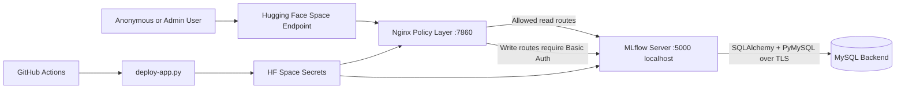
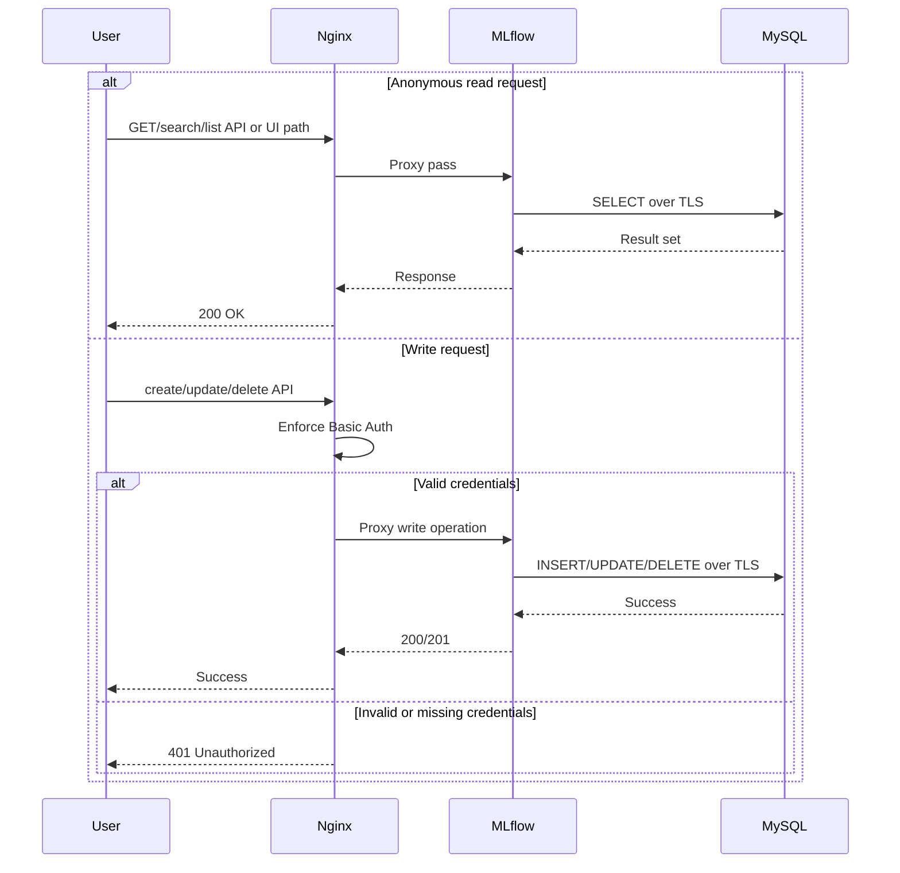

# Architecture: Secure MLflow With Anonymous Read-Only

## Goal

Provide a secure MLflow deployment where:

- Anonymous users can view experiments and runs.
- Authenticated users can create, update, and delete tracking data.
- Backend state is persisted in MySQL over certificate-based TLS.

## Current architecture

## Trust boundaries

1. Public boundary: Internet clients reaching HF Space endpoint.
2. Policy boundary: Nginx route controls before MLflow backend.
3. App boundary: MLflow process bound to localhost and reachable through Nginx.
4. Data boundary: MySQL connection secured with CA-backed TLS.

## Request behavior

## Source of truth in code

- Route policy and auth gates: [app/nginx.conf](../app/nginx.conf)
- Runtime bootstrap and process wiring: [app/Dockerfile](../app/Dockerfile)
- CA materialization and connection mutation: [app/mysql_ca.py](../app/mysql_ca.py)
- Deployment secret propagation: [deploy-app.py](../deploy-app.py)
- CI trigger and secret wiring: [.github/workflows/pipeline.yml](../.github/workflows/pipeline.yml)

## Access control matrix

| Endpoint pattern | Method intent | Anonymous | Authenticated admin |
|---|---|---|---|
| `/ajax-api/2.0/mlflow/(experiments|runs)/(create|delete|update)` | mutate tracking state | denied | allowed |
| all other proxied routes (`location /`) | query UI/data/assets and non-blocked APIs | allowed | allowed |

Notes:

- This matrix reflects current implementation, not all potential MLflow APIs.
- Any mutation endpoint not matched by protected regex may remain effectively open.

## Security posture: current vs target

| Area | Current state | Recommended evolution |
|---|---|---|
| Write authorization | Basic auth on selected regex paths | Expand mutation endpoint coverage and adopt token-aware policies |
| Identity integration | Local credential only | OIDC/Auth proxy with group-based RBAC |
| Auditability | Nginx/MLflow logs only | Centralized SIEM ingestion and immutable audit trails |
| Transport controls | MySQL TLS via CA cert | Add cert expiry monitoring and automated rotation workflows |

## Future extensions

1. Token-based write authorization:
   - Require signed service/user tokens on mutation routes.
   - Keep anonymous reads untouched.
2. OIDC/Auth-proxy model:
   - Delegate authn/authz to enterprise IdP.
   - Map groups to MLflow roles for fine-grained policies.
3. Policy hardening:
   - Shift from allow-by-default to explicit allow-list for read endpoints and deny-by-default fallback.
