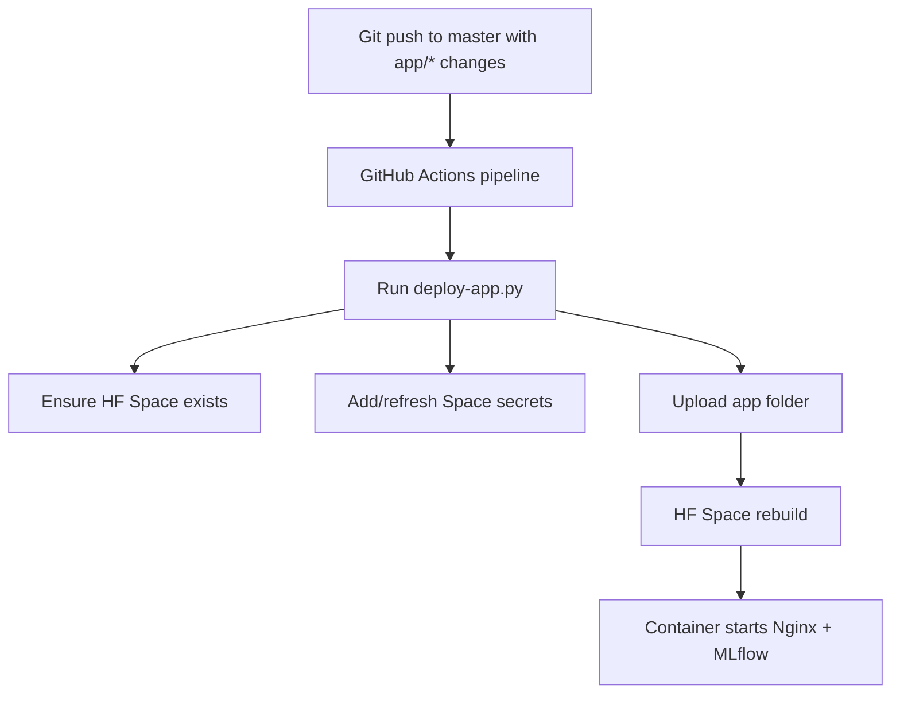

# Deployment and Certificate Security

## Deployment pipeline (current)

Pipeline definition: [.github/workflows/pipeline.yml](../.github/workflows/pipeline.yml)

Trigger:

- Push to `master` with file changes under `app/*`.

Execution flow:

1. Checkout repository.
2. Install `huggingface_hub`.
3. Run [deploy-app.py](../deploy-app.py).
4. Script ensures HF Space exists via [util.py](../util.py).
5. Script injects runtime secrets into HF Space.
6. Script uploads [app](../app) folder content to Space.

## Required secrets and variables

| Name | Location | Purpose |
|---|---|---|
| `HUGGING_FACE_API_KEY` | GitHub secret | API auth for deploying to HF |
| `HF_REPO` | GitHub variable | Target HF Space repo ID |
| `MLFLOW_TRACKING_PASSWORD` | GitHub secret | Basic auth credential used to generate `.htpasswd` |
| `MLFLOW_TRACKING_USERNAME` | GitHub secret | Reserved for auth/user consistency |
| `MLFLOW_MYSQL_CONN` | GitHub secret | Base MySQL connection URI |
| `MLFLOW_MYSQL_CA` | GitHub secret | PEM CA certificate text for MySQL TLS |

## MySQL certificate handling (current)

Current behavior in [app/mysql_ca.py](../app/mysql_ca.py):

1. Reads `MLFLOW_MYSQL_CA` from env.
2. Writes certificate to `ca.pem` in container filesystem.
3. Appends SSL config to `MLFLOW_MYSQL_CONN`.

Operational implication:

- Certificate lifecycle is externally managed and injected at deployment time.
- Rotation currently requires secret update and redeploy.

## Enterprise certificate lifecycle model

Use this model for production-grade operations while preserving current architecture.

### Certificate authority and storage

1. Issue DB client trust material from enterprise CA.
2. Store active cert bundles in Vault/KMS-backed secret manager.
3. Version certificates with metadata: issuer, serial, not-before, expiry.

### Distribution and deploy integration

1. CI fetches current certificate bundle at deploy time.
2. CI writes certificate to GitHub secret or injects directly at runtime via secure action step.
3. Deployment promotes cert version atomically with application config.

### Rotation policy

1. Standard rotation interval: every 60 to 90 days.
2. Emergency rotation: immediate on compromise suspicion.
3. Pre-expiry alert windows: 30, 14, and 7 days.

### Rollout and rollback runbook

1. Pre-validate cert chain and expiry in staging.
2. Deploy new cert to production with canary verification.
3. Run health checks against MLflow read and write paths.
4. If TLS handshake failures occur, roll back to prior cert version and re-run health checks.
5. Record incident timeline and rotate dependent credentials if compromise is suspected.

## Pipeline hardening recommendations

1. Separate deploy identity from runtime secrets ownership.
2. Restrict GitHub environment to protected branches and approval gates.
3. Enforce least-privilege token scopes for HF and secret-manager access.
4. Add automated post-deploy smoke tests:
   - anonymous read endpoint returns 200
   - write endpoint without auth returns 401
   - write endpoint with auth succeeds
5. Add tamper-evident audit logs for secret updates and deploy executions.

## Deployment checklist

1. Confirm `HF_REPO` points to intended Space.
2. Validate CA PEM formatting in `MLFLOW_MYSQL_CA`.
3. Confirm MySQL URI host, db, and user in `MLFLOW_MYSQL_CONN`.
4. Verify workflow triggered by expected `app/*` changes.
5. Validate post-deploy:
   - UI loads anonymously.
   - protected mutation routes challenge for auth.
   - backend persists data over TLS.

## Future auth roadmap alignment

This deployment flow is compatible with progressive auth upgrades:

1. Token gate at Nginx/policy layer for write routes.
2. OIDC/auth-proxy integration for SSO and role mapping.
3. Central policy engine (optional) for endpoint-level decisions.
